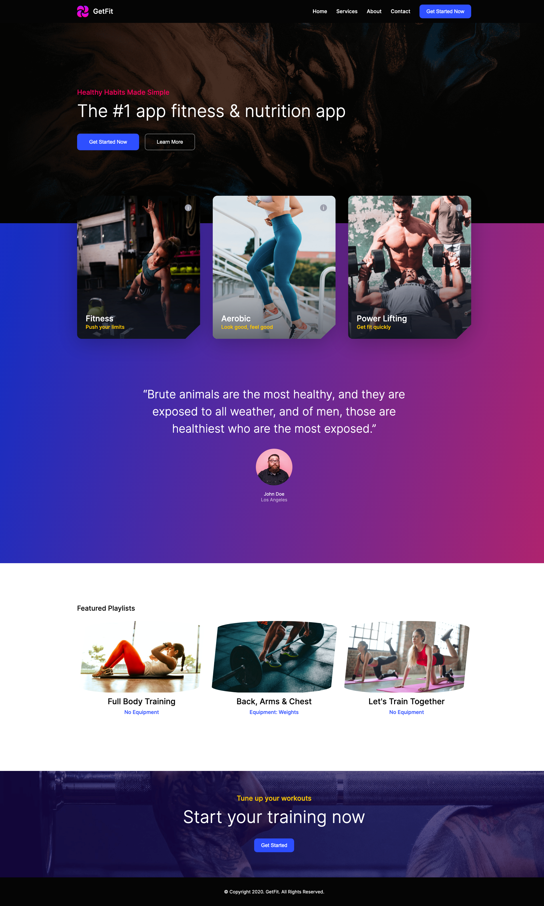
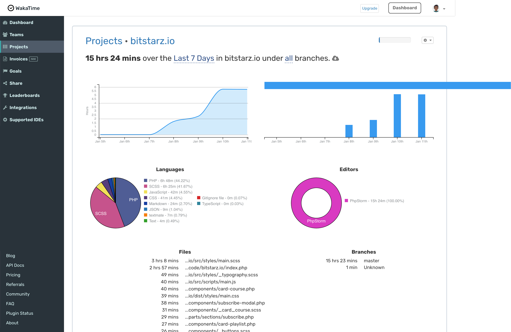

## Result

----

## Wakatime

https://wakatime.com/@craigiswayne/projects/bxlxcrizza?start=2022-01-05&end=2022-01-11

----

## NOTES:
1. Using alot of the same naming convention as bootstrap
2. Using php partials for reusability, DRY approach
3. Compressed all images for faster load, the hero image is a bit of a lower quality though, you can compare the compressee to the uncompressed
4. Kinda gave up making notes since i was running outta time

### How to Improve
1. Start with outline of site first, grayscale -> see figma's outline
2. Create layers of comments with process, 1 layer for fonts and weights for example (tablet required)
3. Layer for classes
4. once everything has a class, group them
5. start adding css to classes
   1. buttons are the easiest
6. Identify font-sizes
   1. list them according to size increasingly, then come up with class names for them, i.e. normal, small, large, medium 
   2. identify font-families
7. Identify H1, H2 etc etc
